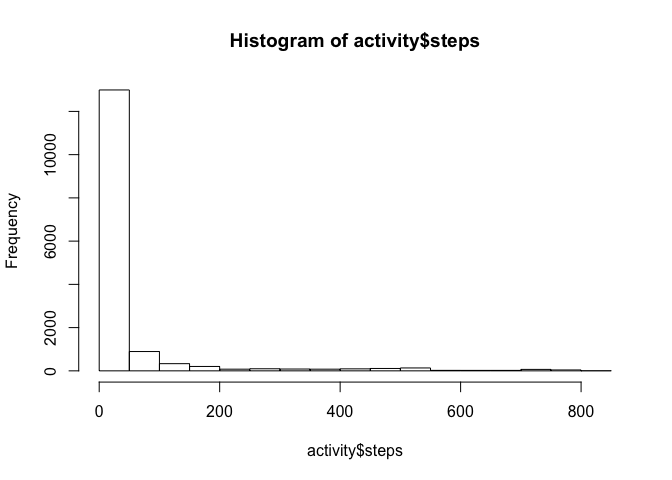
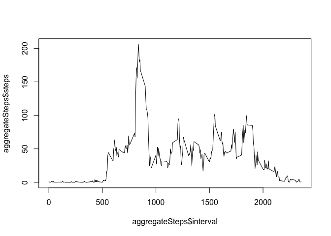
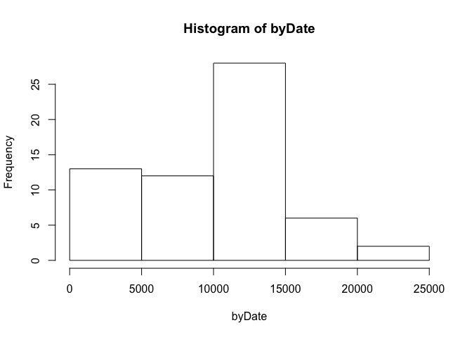

# Reproducible Research: Peer Assessment 1


## Loading and preprocessing the data

The activity.csv in the current folder is loaded

```r
activity <- read.csv('activity.csv')
```


## What is mean total number of steps taken per day?


```r
summary(activity$steps)
```

```
##    Min. 1st Qu.  Median    Mean 3rd Qu.    Max.    NA's 
##    0.00    0.00    0.00   37.38   12.00  806.00    2304
```

```r
hist(activity$steps)
```

 

```r
totalSteps <- sum(activity$steps,na.rm=TRUE)
print(totalSteps)
```

```
## [1] 570608
```

```r
meanSteps <- mean(activity$steps,na.rm=TRUE)
print(meanSteps)
```

```
## [1] 37.3826
```

```r
medianSteps <- median(activity$steps,na.rm=TRUE)
print(medianSteps)
```

```
## [1] 0
```
## What is the average daily activity pattern?

```r
aggregateSteps <- aggregate(activity,list(activity$interval),mean,na.rm=TRUE)
plot(aggregateSteps$interval,aggregateSteps$steps,type="l")
```

 

```r
maxSteps <- which.max(aggregateSteps$steps)
aggregateSteps[maxSteps,]["interval"]
```

```
##     interval
## 104      835
```
## Imputing missing values

0 is the most common value so it is assumed for the NA


```r
colSums(is.na(activity))
```

```
##    steps     date interval 
##     2304        0        0
```

```r
numSteps <- subset(activity,!is.na(activity$steps))
naSteps <- subset(activity,is.na(activity$steps))
str(numSteps)
```

```
## 'data.frame':	15264 obs. of  3 variables:
##  $ steps   : int  0 0 0 0 0 0 0 0 0 0 ...
##  $ date    : Factor w/ 61 levels "2012-10-01","2012-10-02",..: 2 2 2 2 2 2 2 2 2 2 ...
##  $ interval: int  0 5 10 15 20 25 30 35 40 45 ...
```

```r
str(naSteps)
```

```
## 'data.frame':	2304 obs. of  3 variables:
##  $ steps   : int  NA NA NA NA NA NA NA NA NA NA ...
##  $ date    : Factor w/ 61 levels "2012-10-01","2012-10-02",..: 1 1 1 1 1 1 1 1 1 1 ...
##  $ interval: int  0 5 10 15 20 25 30 35 40 45 ...
```

```r
for(i in seq(1:dim(naSteps))){
  naSteps[i,"steps"] <- 0
  }
```

```
## Warning in 1:dim(naSteps): numerical expression has 2 elements: only the
## first used
```

```r
str(naSteps)
```

```
## 'data.frame':	2304 obs. of  3 variables:
##  $ steps   : num  0 0 0 0 0 0 0 0 0 0 ...
##  $ date    : Factor w/ 61 levels "2012-10-01","2012-10-02",..: 1 1 1 1 1 1 1 1 1 1 ...
##  $ interval: int  0 5 10 15 20 25 30 35 40 45 ...
```

```r
stepsImputed <- rbind(numSteps,naSteps)
str(stepsImputed)
```

```
## 'data.frame':	17568 obs. of  3 variables:
##  $ steps   : num  0 0 0 0 0 0 0 0 0 0 ...
##  $ date    : Factor w/ 61 levels "2012-10-01","2012-10-02",..: 2 2 2 2 2 2 2 2 2 2 ...
##  $ interval: int  0 5 10 15 20 25 30 35 40 45 ...
```

```r
byDate <- tapply(stepsImputed$steps,stepsImputed$date,sum)
hist(byDate)
```

 

```r
tapply(stepsImputed$steps,stepsImputed$date,mean)
```

```
## 2012-10-01 2012-10-02 2012-10-03 2012-10-04 2012-10-05 2012-10-06 
##  0.0000000  0.4375000 39.4166667 42.0694444 46.1597222 53.5416667 
## 2012-10-07 2012-10-08 2012-10-09 2012-10-10 2012-10-11 2012-10-12 
## 38.2465278  0.0000000 44.4826389 34.3750000 35.7777778 60.3541667 
## 2012-10-13 2012-10-14 2012-10-15 2012-10-16 2012-10-17 2012-10-18 
## 43.1458333 52.4236111 35.2048611 52.3750000 46.7083333 34.9166667 
## 2012-10-19 2012-10-20 2012-10-21 2012-10-22 2012-10-23 2012-10-24 
## 41.0729167 36.0937500 30.6284722 46.7361111 30.9652778 29.0104167 
## 2012-10-25 2012-10-26 2012-10-27 2012-10-28 2012-10-29 2012-10-30 
##  8.6527778 23.5347222 35.1354167 39.7847222 17.4236111 34.0937500 
## 2012-10-31 2012-11-01 2012-11-02 2012-11-03 2012-11-04 2012-11-05 
## 53.5208333  0.0000000 36.8055556 36.7048611  0.0000000 36.2465278 
## 2012-11-06 2012-11-07 2012-11-08 2012-11-09 2012-11-10 2012-11-11 
## 28.9375000 44.7326389 11.1770833  0.0000000  0.0000000 43.7777778 
## 2012-11-12 2012-11-13 2012-11-14 2012-11-15 2012-11-16 2012-11-17 
## 37.3784722 25.4722222  0.0000000  0.1423611 18.8923611 49.7881944 
## 2012-11-18 2012-11-19 2012-11-20 2012-11-21 2012-11-22 2012-11-23 
## 52.4652778 30.6979167 15.5277778 44.3993056 70.9270833 73.5902778 
## 2012-11-24 2012-11-25 2012-11-26 2012-11-27 2012-11-28 2012-11-29 
## 50.2708333 41.0902778 38.7569444 47.3819444 35.3576389 24.4687500 
## 2012-11-30 
##  0.0000000
```

```r
tapply(stepsImputed$steps,stepsImputed$date,median)
```

```
## 2012-10-01 2012-10-02 2012-10-03 2012-10-04 2012-10-05 2012-10-06 
##          0          0          0          0          0          0 
## 2012-10-07 2012-10-08 2012-10-09 2012-10-10 2012-10-11 2012-10-12 
##          0          0          0          0          0          0 
## 2012-10-13 2012-10-14 2012-10-15 2012-10-16 2012-10-17 2012-10-18 
##          0          0          0          0          0          0 
## 2012-10-19 2012-10-20 2012-10-21 2012-10-22 2012-10-23 2012-10-24 
##          0          0          0          0          0          0 
## 2012-10-25 2012-10-26 2012-10-27 2012-10-28 2012-10-29 2012-10-30 
##          0          0          0          0          0          0 
## 2012-10-31 2012-11-01 2012-11-02 2012-11-03 2012-11-04 2012-11-05 
##          0          0          0          0          0          0 
## 2012-11-06 2012-11-07 2012-11-08 2012-11-09 2012-11-10 2012-11-11 
##          0          0          0          0          0          0 
## 2012-11-12 2012-11-13 2012-11-14 2012-11-15 2012-11-16 2012-11-17 
##          0          0          0          0          0          0 
## 2012-11-18 2012-11-19 2012-11-20 2012-11-21 2012-11-22 2012-11-23 
##          0          0          0          0          0          0 
## 2012-11-24 2012-11-25 2012-11-26 2012-11-27 2012-11-28 2012-11-29 
##          0          0          0          0          0          0 
## 2012-11-30 
##          0
```


## Are there differences in activity patterns between weekdays and weekends?
